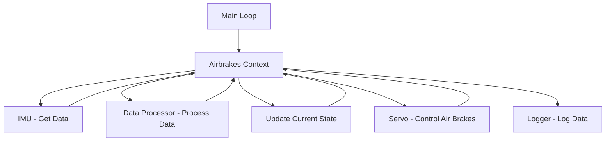

# AirbrakesV2 🚀

## Overview
This project is for controlling our Air brakes system with the goal of making our rocket "hit" its target apogee. We have a Raspberry Pi 4 as the brains of our system which runs our code. It connects to a servo motor to control the extension of our air brakes and an [IMU](https://www.microstrain.com/inertial-sensors/3dm-cx5-15) (basically an altimeter, accelerometer, and gyroscope). The code follows the [finite state machine](https://www.tutorialspoint.com/design_pattern/state_pattern.htm) design pattern, using the [`AirbrakesContext`](https://github.com/NCSU-High-Powered-Rocketry-Club/AirbrakesV2/blob/main/airbrakes/airbrakes.py) to manage interactions between the states, hardware, logging, and data processing. 

https://github.com/user-attachments/assets/0c72a9eb-0b15-4fbf-9e62-f6a69e5fadaa

_A video of our air brakes extending and retracting_

### Design
As per the finite state machine design pattern, we have a context class which links everything together. Every loop, the context:

1. **Gets data from the IMU**
2. **Processes the data** in the Data Processor (calculates speed, averages, maximums, etc.)
3. **Updates the current state** with the processed data
4. **Controls the servo extension** based on the current state's instructions (e.g., extends air brakes to slow down the rocket)
5. **Logs all data** from the IMU, Data Processor, Servo, and States


### Launch Data

This is our interest launch flight data, altitude over time. The different colors of the line are different states the rocket goes through:
1. Stand By - when the rocket is on the rail on the ground
2. Motor Burn - when the motor is burning and the rocket is accelerating
3. Coast - when the motor has burned out and the rocket is coasting, this is when air brakes will be deployed
4. Free Fall - when the rocket is falling back to the ground after apogee, this is when the air brakes will be
retracted
5. Landed - when the rocket has landed on the ground


### File Structure

We have put great effort into keeping the file structure of this project organized and concise. Try to be intentional on where you place new files or directories.
```
AirbrakesV2/
├── airbrakes/
|   ├── hardware/
│   │   ├── [files related to the connection of the pi with hardware ...]
|   ├── mock/
│   │   ├── [files related to the connection of mock (or simulated) hardware ...]
|   ├── data_handling/
│   │   ├── [files related to the processing of data ...]
│   ├── [files which control the airbrakes at a high level ...]
├── tests/  [used for testing all the code]
│   ├── ...
├── logs/  [log files made by the logger]
│   ├── ...
├── scripts/  [small files to test individual components like the servo]
│   ├── ...
├── main.py [main file used to run on the rocket]
├── constants.py [file for constants used in the project]
├── pyproject.toml [configuration file for the project]
├── README.md
```

## Local Setup

**This project uses Python 3.12. Using an older version may not work since we use newer language features**

### Clone the repository:

```
git clone https://github.com/NCSU-High-Powered-Rocketry-Club/AirbrakesV2.git
cd AirbrakesV2
```

### Set up a virtual environment:

```bash
python -m venv .venv

# For Linux
source .venv/bin/activate
# For Windows
.\.venv\Scripts\activate
```

### Install the required dependencies:

```bash
pip install .[dev]
```
_There are libraries that only fully work when running on the Pi (gpiozero, mscl), so if you're having trouble importing them locally, program the best you can and test your changes on the pi._

## Local Usage

### Running Mock Launches
Testing our code can be difficult, so we've developed a way to run mock launches based on previous flight data--the rocket pretends, in real-time, that it's flying through a previous launch.

To run a mock launch, make sure to first specify the path to the CSV file for the previous launch's data in `constants.py` and then run:
```bash
python3 main.py m
```
### Running Tests
Our CI pipeline uses [pytest](https://pytest.org) to run tests. You can run the tests locally to ensure that your changes are working as expected.

To run the tests, run this command from the project root directory:
```bash
pytest
```
If you make a change to the code, please make sure to update or add the necessary tests.

### Running the Linter

Our CI also tries to maintain code quality by running a linter. We use [Ruff](https://docs.astral.sh/ruff/).

To run the linter, and fix any issues it finds, run:
```bash
ruff check . --fix --unsafe-fixes
```
To format the code, run:
```bash
ruff format .
```

## Pi Usage

### Connecting to the Pi (SSH)
In order to connect to the Pi, you need first to set up a mobile hotspot with the name `HPRC`, password `tacholycos`, and `2.4 GHz` band. Next, turn on the Pi and it will automatically connect to your hotspot. Once it's connected, find the Pi's IP Address, and in your terminal run:
```bash
ssh pi@[IP.ADDRESS]
# Its password is raspberry
cd AirbrakesV2/
```

### Install and start the pigpio daemon on the Raspberry Pi:
_Every time the pi boots up, you must run this in order for the servo to work. We have already added this command to run on startup, but you may want to confirm that it is running, e.g. by using `htop`._

```bash
sudo pigpiod
```

### Running Test Scripts
During development, you may want to run individual scripts to test components. For example, to test the servo, run:
```bash
# Make sure you are in the root directory,
python3 -m scripts.run_servo
```

### Running Mock Launches
If you want to connect to the servo so you can see the air brakes extension in realtime, run
```bash
python3 main.py m rs
```

## Contributing
Feel free to submit issues or pull requests. For major changes, please open an issue first to discuss what you would like to change.

## License
This project is licensed under the MIT License. You are free to copy, distribute, and modify the software, provided that the original license notice is included in all copies or substantial portions of the software. See LICENSE for more.
