# AirbrakesV2 🚀

# Table of Contents

- [Overview](#overview)
- [Design](#design)
- [System Architecture Flowchart](#system-architecture-flowchart)
- [Launch Data](#launch-data)
- [File Structure](#file-structure)
- [Quick Start](#quick-start)
- [Local Setup](#local-setup)
  - [1. Clone the repository](#1-clone-the-repository)
  - [2. Install the project](#2-install-the-project)
  - [3. Install the pre-commit hook](#3-install-the-pre-commit-hook)
  - [4. Make your changes and commit](#4-make-your-changes-and-commit)
- [Advanced Local Usage](#advanced-local-usage)
  - [Running Mock Launches](#running-mock-launches)
  - [Running Tests](#running-tests)
  - [Running the Linter](#running-the-linter)
- [Pi Usage](#pi-usage)
  - [Connecting to the Pi (SSH)](#connecting-to-the-pi-ssh)
  - [Install and start the pigpio daemon on the Raspberry Pi](#install-and-start-the-pigpio-daemon-on-the-raspberry-pi)
  - [Run a real flight with real hardware](#run-a-real-flight-with-real-hardware)
  - [Running Test Scripts](#running-test-scripts)
- [Contributing](#contributing)
- [License](#license)


## Overview
This project is for controlling our air brakes system with the goal of making our rocket "hit" its target apogee. We have a Raspberry Pi 5 as the brains of our system which runs our code. It connects to a servo motor to control the extension of our air brakes and an [IMU](https://www.microstrain.com/inertial-sensors/3dm-cx5-15) (basically an altimeter, accelerometer, and gyroscope). The code follows the [finite state machine](https://www.tutorialspoint.com/design_pattern/state_pattern.htm) design pattern, using the [`AirbrakesContext`](https://github.com/NCSU-High-Powered-Rocketry-Club/AirbrakesV2/blob/main/airbrakes/airbrakes.py) to manage interactions between the states, hardware, logging, and data processing. 

https://github.com/user-attachments/assets/0c72a9eb-0b15-4fbf-9e62-f6a69e5fadaa

_A video of our air brakes extending and retracting_

### Design
As per the finite state machine design pattern, we have a context class which links everything together. Every loop, the context:

1. **Gets data from the IMU**
2. **Processes the data** in the Data Processor (calculates velocity, averages, maximums, etc.)
3. **Updates the current state** with the processed data
4. **Predicts the apogee** If the program is in Coast State
5. **Controls the servo extension** based on the current state's instructions (e.g., extends air brakes to slow down the rocket)
6. **Logs all data** from the IMU, Data Processor, Servo, Apogee Predictor and States

### System Architecture Flowchart

```mermaid
%%{init: {'theme': 'dark'}}%%
flowchart TD

    %% Define styles for different shapes
    classDef circular fill:#44007e,stroke:#fff,stroke-width:2px,rx:50%,ry:50%;  %% Ovals for classes
    classDef bubble fill:#164b6c,stroke:#fff,stroke-width:2px,rx:10px,ry:10px; %% Bubbles for methods
    classDef outputSquare fill:#044728,stroke:#fff,stroke-width:2px; %% Squares for outputs
    classDef textStyle fill:none,color:#fff,font-weight:bold,font-size:16px; %% Text style for bold white text
    classDef mainColor fill:#ac6600,stroke:#fff,stroke-width:2px,rx:50%,ry:50%; %% Color for main.py

    %% Main structure with main.py at the top
    subgraph mainFlow[Main Flow]
      direction TB
      mainpy((main.py)):::mainColor --> Airbrakes((Airbrakes Context)):::circular
     
    end
    Airbrakes --> Update[update]:::bubble
    %% IMU Data Packet Flow
    IMUDataPacket --> Update
    Apogee_Predictor --> Update
    
    %% States as individual nodes
    State((State)):::circular
    Standbystate((Standby)):::circular
    MotorBurnState((Motor Burn)):::circular
    CoastState((Coast)):::circular
    FreefallState((Freefall)):::circular
    LandedState((Landed)):::circular
    

    %% Connections between States and Airbrakes
    State((State)):::circular --> Airbrakes:::circular
    State --> Update
    
    Standbystate((Standby)):::circular --> State
    MotorBurnState((Motor Burn)):::circular --> State
    CoastState((Coast)):::circular --> State
    FreefallState((Freefall)):::circular --> State
    LandedState((Landed)):::circular --> State
    
    %% Connections with Labels
    Airbrakes ---|Child Process| Logger((Logger)):::circular
    Airbrakes ---|Child Process| IMU((IMU)):::circular
    Airbrakes ---|Child Process| Apogee_Predictor((Apogee Predictor)):::circular
    IMU((IMU)):::circular ---|Fetch Packets| IMUDataPacket[(IMU Data Packet)]:::outputSquare

    %% Data Processing
    IMUDataPacket --> DataProcessor[Data Processor]:::circular
    DataProcessor --> Velocity[(Velocity)]:::outputSquare
    DataProcessor --> Altitude[(Altitude)]:::outputSquare
    DataProcessor --> Rotated_Accel[(Rotated Acceleration)]:::outputSquare
    
    Velocity -->  ProcessedData[(Processor Data Packet)]:::outputSquare
    Altitude -->  ProcessedData[(Processor Data Packet)]:::outputSquare
    Rotated_Accel -->  ProcessorData[(Processor Data Packet)]:::outputSquare
    
    ProcessorData[(Processor Data Packet)]:::outputSquare --> Update

    %% Logging Mechanism
    Logger --> LogFunction[log]:::bubble
    Update --> LogData[(Logger Data Packet)]:::outputSquare
    LogData --> LogFunction

    %% Airbrake Control Methods with Parentheses Displayed
    Update --> ExtendAirbrakes[extend_airbrakes]:::bubble
    Update --> RetractAirbrakes[retract_airbrakes]:::bubble

    %% Servo Connections
    RetractAirbrakes --> Servo((Servo)):::circular 
    ExtendAirbrakes --> Servo
    Airbrakes --> Servo

```

| Type        | Color                                                                     | Examples                                                                                                   |
|-------------|---------------------------------------------------------------------------|------------------------------------------------------------------------------------------------------------|
| Entry point |  `#ac6600` | Main.py                                                                                                    |
| Classes     |  `#44007e` | Airbrakes Context, State, Logger, IMU, Data Processor, Servo, Coast, Standby, Freefall, Landed, Motor Burn |
| Methods     |  `#164b6c` | update(), log(), extend_airbrakes(), retract_airbrakes()                                                   |
| Outputs     |  `#044728` | IMU Data Packet, Processor Data Packet, Logger Data Packet                                                 |

### Launch Data

This is our interest launch flight data, altitude over time. The different colors of the line are different states the rocket goes through:
1. Standby - when the rocket is on the rail on the ground.
2. Motor Burn - when the motor is burning and the rocket is accelerating.
3. Coast - after the motor has burned out and the rocket is coasting, this is when air brakes
deployment will be controlled by the bang-bang controller.
4. Free Fall - when the rocket is falling back to the ground after apogee, this is when the air
brakes will be retracted.
5. Landed - when the rocket lands on the ground. After a few seconds in landed state, the
Airbrakes program will end.


### File Structure

We have put great effort into keeping the file structure of this project organized and concise. Try to be intentional on where you place new files or directories.
```
AirbrakesV2/
├── airbrakes/
|   ├── hardware/
│   │   ├── [files related to the connection of the pi with hardware ...]
|   ├── mock/
│   │   ├── [files related to the connection of mock (or simulated) hardware ...]
|   ├── simulation/
│   │   ├── [files related to our custom air brakes sim ...]
|   ├── telemetry/
│   │   ├── [files related to the processing of data ...]
│   ├── [files which control the air brakes at a high level ...]
|   ├── main.py [main file used to run on the rocket]
|   ├── constants.py [file for constants used in the project]
├── tests/  [used for testing all the code]
│   ├── ...
├── logs/  [log files made by the logger]
│   ├── ...
├── launch_data/  [real flight data collected from the rocket]
│   ├── ...
├── scripts/  [small files to test individual components like the servo]
│   ├── ...
├── pyproject.toml [configuration file for the project]
├── README.md
```

## Quick Start

This project only supports Linux. We also strongly recommend using [`uv`](https://docs.astral.sh/uv/) to manage and install
the project. To quickly run the mock replay, simply run:

```bash
uvx --from git+https://github.com/NCSU-High-Powered-Rocketry-Club/AirbrakesV2.git mock
```

You should see the mock replay running with a display!

_Note: We will continue using `uv` for the rest of this README, if you don't want to use `uv`, you can set up the project using Python. See [Legacy Project Setup](legacy_project_setup.md) for more information._

## Local Setup

If you want to contribute to the project, you will need to set up the project locally. Luckily, 
the only other thing you need to install is [`git`](https://git-scm.com/) for version control.

### 1. Clone the repository:

```
git clone https://github.com/NCSU-High-Powered-Rocketry-Club/AirbrakesV2.git
cd AirbrakesV2
```

### 2. Install the project:
```bash
uv run mock
```

This will install the project, including development dependencies, activate the virtual environment and run the mock replay.

_Note: It is important to use `uv run` instead of `uvx` since the `uvx` environment is isolated from
the project. See the [uv documentation](https://docs.astral.sh/uv/concepts/tools/#relationship-to-uv-run) for more information._

_Note 2: The more "correct" command to run is `uv sync`. This will install the project and its dependencies, but not run the mock replay._

### 3. Install the pre-commit hook:
```
uv run pre-commit install
```
This will install a pre-commit hook that will run the linter before you commit your changes.

You will see the linter run now. If one of the checks failed, you can resolve them by following the 
instructions in [Running the Linter](#running-the-linter).

```bash
git push -u origin branch-name
```

## Advanced Local Usage

### Running Mock Launches
Testing our code can be difficult, so we've developed a way to run mock launches based on previous flight data--the rocket pretends, in real-time, that it's flying through a previous launch.

To run a mock launch, run:
```bash
uv run mock
```
If you want to run a mock launch, but with the real servo running, run:
```bash
uv run mock -r
```
To run a mock launch with our custom simulation:
```bash
uv run sim
```
There are some additional options you can use when running a mock launch. To view them all, run:
```bash
uv run mock --help
```

### Running Tests
Our CI pipeline uses [pytest](https://pytest.org) to run tests. You can run the tests locally to ensure that your changes are working as expected.

_Note: Unit tests do not work on Windows (only `test_integration.py` will work)._

To run the tests, run this command from the project root directory:
```bash
uv run pytest
```

If your virtual environment is activated, you can simply run the tests with `pytest`

To generate a coverage report from the tests:
```bash
pytest --cov=airbrakes --cov-report=term
```

To performance test the code:
```bash
pytest --benchmark-only --benchmark-save=name
```

See the [pytest-benchmark documentation](https://pytest-benchmark.readthedocs.io/en/stable/) for more information.

To run a performance benchmark with the real IMU on the raspberry pi:
```bash
sudo $(which uv) run pytest -m imu_benchmark
```

Note that the use of `sudo` is required to set process priorities for the IMU and main process,
which is critical for accurate benchmarking.

If you make a change to the code, please make sure to update or add the necessary tests.

### Running the Linter

Our CI also tries to maintain code quality by running a linter. We use [Ruff](https://docs.astral.sh/ruff/).

To run the linter, and fix any issues it finds, run:
```bash
ruff check . --fix --unsafe-fixes
```
To format the code, run:
```bash
ruff format .
```
You can also run the linter with `uv`:
```bash
uv run ruff format .
```

## Pi Usage

_There are libraries that only fully work when running on the Pi (gpiozero, mscl, picamera2), so if you're having trouble importing them locally, program the best you can and test your changes on the pi._


### Connecting to the Pi (SSH)
In order to connect to the Pi, you need first to set up a mobile hotspot with the name `HPRC`, password `tacholycos`, and `2.4 GHz` band. Next, turn on the Pi and it will automatically connect to your hotspot. Once it's connected, find the Pi's IP Address, and in your terminal run:
```bash
ssh pi@[IP.ADDRESS]
# Its password is "raspberry"
cd AirbrakesV2/
```

### Install the dependencies needed for the camera and servo integration:

```bash
sudo apt install libcap-dev libcamera-dev libkms++-dev libfmt-dev libdrm-dev liblgpio-dev

uv sync --all-groups
```


### Run a real flight with real hardware:
```bash
sudo $(which uv) run real -v
```

### Running Test Scripts
During development, you may want to run individual scripts to test components. For example, to test the servo, run:
```bash
# Make sure you are in the root directory:
uv run scripts/run_servo.py
```

## Contributing
Feel free to submit issues or pull requests. For major changes, please open an issue first to discuss what you would like to change.

## License
This project is licensed under the MIT License. You are free to copy, distribute, and modify the software, provided that the original license notice is included in all copies or substantial portions of the software. See LICENSE for more.
